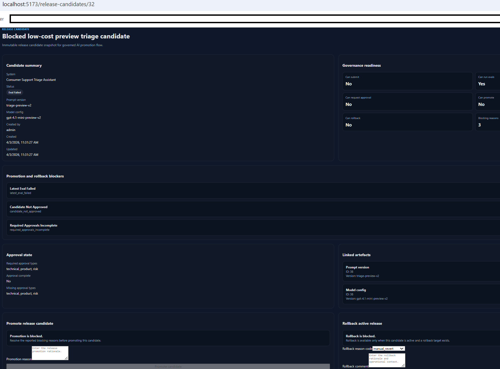
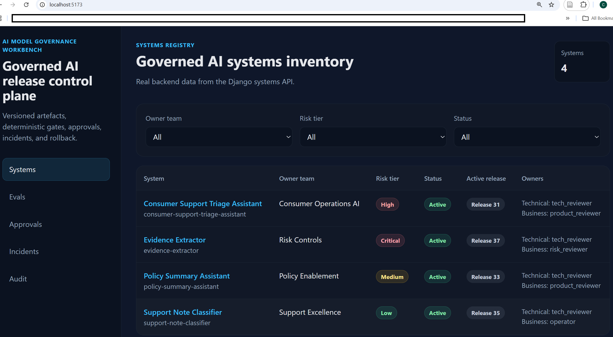
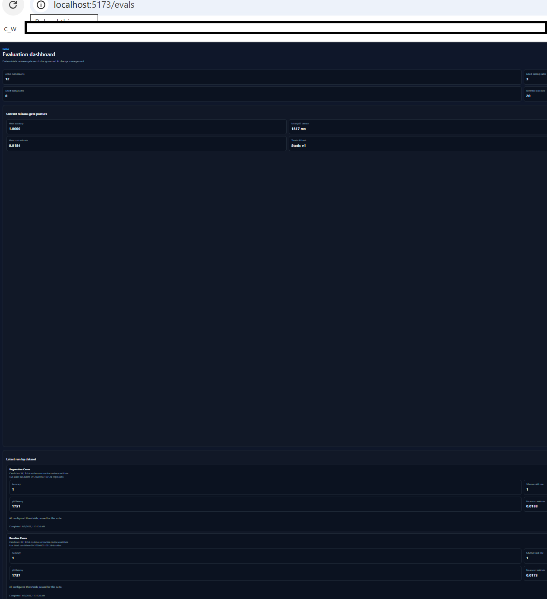
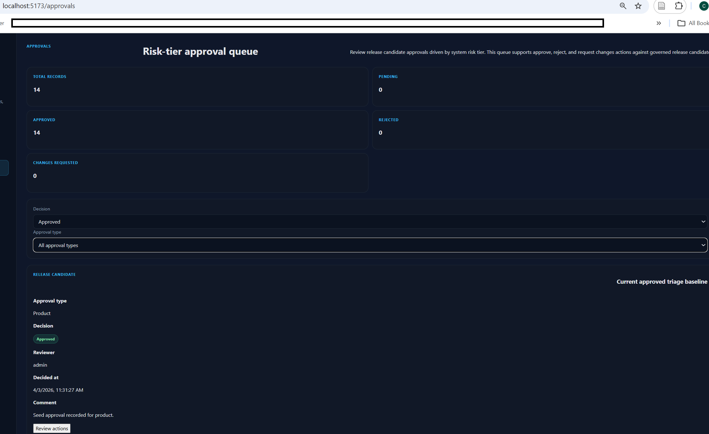
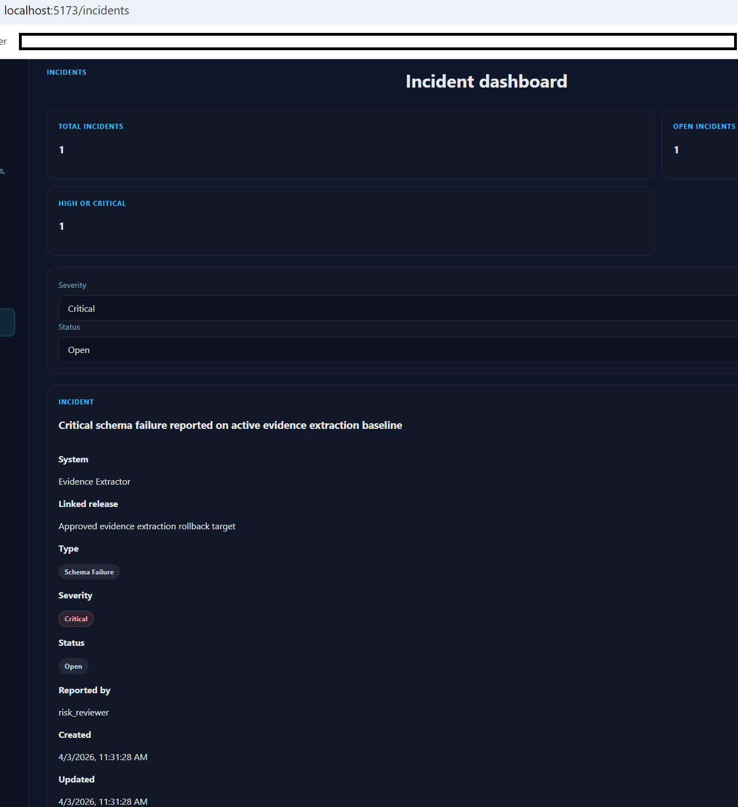
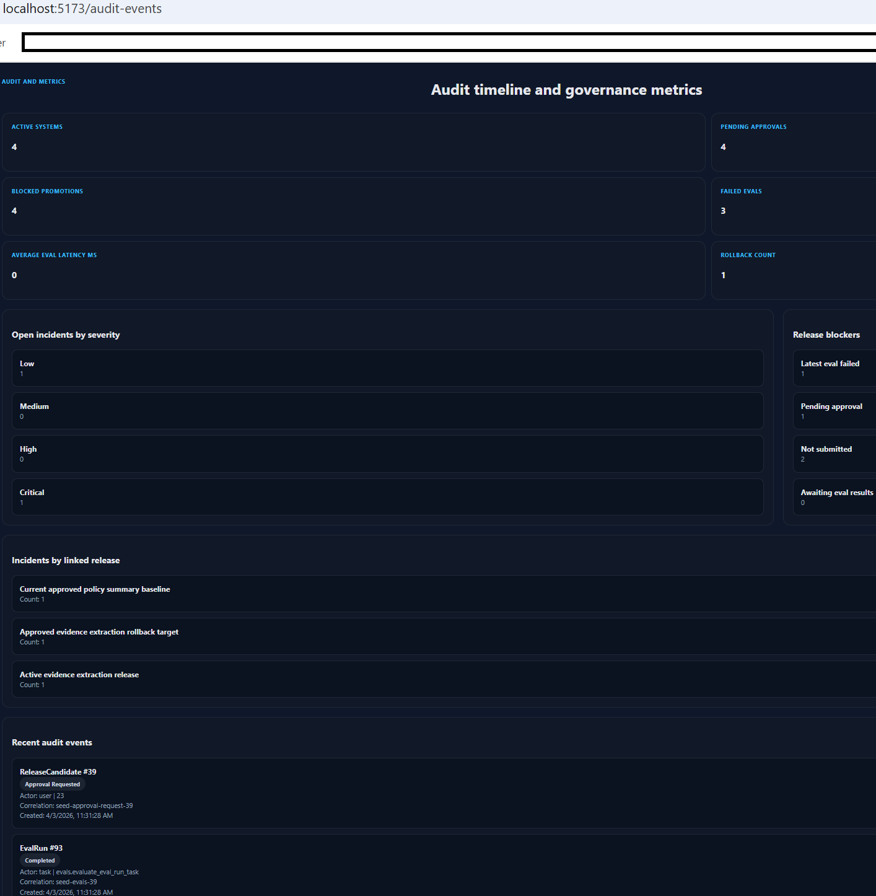

# AI Model Governance Workbench

Internal control plane for managing prompt versions, model configurations, evaluation runs, approval gates, incidents, and rollback across AI-enabled product workflows.

AI Model Governance Workbench is a Django/React modular monolith that simulates an internal governance platform for AI-enabled systems. It treats prompts, model configurations, eval datasets, release candidates, approvals, incidents, and rollback actions as first-class governed artefacts. Teams can register AI systems, create versioned prompt and model configs, assemble immutable release candidates, run benchmark suites, block promotion on failed thresholds, require policy-driven approvals, track incidents, and roll back to previously approved releases with full audit history.

## Why this project exists

Most portfolio AI projects focus on end-user interaction. This project is deliberately different. It focuses on the internal platform problem that appears once teams actually ship AI-enabled systems in production: how to change prompts and models safely, measure regressions, require approvals, preserve rollback paths, and retain a clear record of what changed, who approved it, and why.

This repository is designed to demonstrate platform-oriented engineering rather than chatbot UX. The core value is controlled AI change management, not prompt experimentation.

## What it demonstrates

- AI system registry with ownership, risk tiering, and lifecycle status
- versioned prompt artefacts with contracts and review state
- versioned model/runtime configurations with routing and fallback policy
- immutable release candidates built from prompt and model snapshots
- evaluation datasets, synthetic regression runs, and threshold gating
- approval workflows driven by risk tier
- promotion rules that block unsafe releases
- rollback to previously approved releases with preserved history
- incident tracking linked to governed release state
- audit timeline with immutable event records
- metrics dashboards for blocked promotions, failed evals, latency, cost, and incidents
- async workflow execution with Celery and Redis
- OpenAPI-first backend documentation
- backend, frontend, workflow, and regression testing

## Core workflow

1. Register an AI-enabled system.
2. Create prompt and model configuration versions.
3. Assemble a release candidate snapshot.
4. Run evaluation datasets against the candidate.
5. Block or allow promotion based on deterministic thresholds.
6. Collect required approvals based on risk tier.
7. Promote an approved candidate to active release.
8. Log incidents and trigger rollback when needed.
9. Preserve the full lifecycle in an auditable timeline.

## Why it stands out as a portfolio project

This project is meant to read as an internal AI governance control plane, not a generic admin dashboard and not a toy inference demo.

It is stronger than a CRUD app because it includes:
- stateful lifecycle control
- deterministic promotion gates
- immutable release snapshots
- incident-linked rollback
- risk-tier approval policy
- audit-heavy operational evidence

It is stronger than a typical AI app because it proves:
- platform thinking
- operational modelling
- release safety
- evaluation discipline
- full-stack implementation depth
- architecture decisions that can be defended in interviews

## Primary downstream example

The main seeded downstream example is:

**Consumer Support Triage Assistant**

This keeps the governance story concrete without turning the project into an end-user support product. It provides a realistic basis for:
- classification-style quality scoring
- review-routing logic
- schema-validity checks
- latency and cost thresholds
- incident and rollback scenarios

## Screenshots

### Blocked release candidate



Release candidate blocked from promotion by failed thresholds and incomplete approvals.

### Systems registry



AI systems registry with ownership, risk tiers, active releases, and operational context.

### Evaluation dashboard



Evaluation dashboard with threshold results, release-gate posture, dataset coverage, and execution evidence.

### Approval queue



Approval queue with risk-tier-driven review requirements and decision actions.

### Incident dashboard



Incident dashboard connecting operational issues to governed release history and rollback context.

### Audit timeline



Audit timeline showing immutable event history, blocker counts, and governance metrics.

## Architecture

### System shape

- modular monolith
- Django + Django REST Framework backend
- React + TypeScript + Vite frontend
- PostgreSQL as the intended system of record
- Redis for Celery broker/result backend
- Celery for async eval runs and reporting tasks
- Docker Compose for local infrastructure

### Architectural intent

The platform is designed around governed change management for AI-enabled workflows.

Pipeline:

`system registry -> prompt/model config store -> release candidate -> eval runner -> approval gate -> active release registry -> incident/rollback plane -> reporting UI`

### Backend app boundaries

- `core` - shared middleware, pagination, common utilities
- `accounts` - users and reviewer identity
- `systems` - AI system registry
- `prompts` - versioned prompt artefacts
- `model_configs` - versioned model/runtime configurations
- `releases` - release candidates, promotion events, rollback records
- `approvals` - approval records and policy logic
- `incidents` - incident lifecycle and mitigation
- `evals` - datasets, cases, runs, thresholding
- `audits` - immutable audit timeline
- `observability` - metrics aggregation and execution logs
- `health` - liveness, readiness, and dependency endpoints

### Frontend posture

The frontend is a control plane UI, not a consumer experience. It focuses on:
- systems registry
- governed artefact detail views
- candidate evaluation results
- approval queue
- incident dashboard
- audit timeline
- operational metrics

### Key design decisions

- prompts and model configs are treated as deployable artefacts
- release candidates are immutable snapshots after submission
- promotion is blocked by deterministic rules
- incidents are first-class and can trigger rollback
- audit history is append-only and visible
- workflow logic is explicit and testable

## Domain model

### Core entities

- `AISystem`
- `PromptVersion`
- `ModelConfig`
- `EvalDataset`
- `EvalCase`
- `ReleaseCandidate`
- `EvalRun`
- `EvalRunCaseResult`
- `ApprovalRecord`
- `PromotionEvent`
- `Incident`
- `RollbackRecord`
- `AuditEvent`
- `ModelExecutionLog`

### Important rules

- prompt and model changes are versioned
- release candidates snapshot prompt and model state
- snapshots are immutable after submission
- promotion requires a passing latest eval
- promotion requires all mandatory approvals for the system risk tier
- high or critical active incidents block new promotions
- one system can have only one active release at a time
- rollback targets must be previously approved compatible releases
- audit events are immutable and cover all important transitions

### Risk-tier approval policy

- `low` -> technical
- `medium` -> technical + product
- `high` -> technical + product + risk
- `critical` -> technical + product + risk + governance

## Evaluation and release gating

The evaluation system exists to make governance meaningful.

### Dataset categories

- baseline
- regression
- adversarial
- routing
- rollback validation

### Typical metrics

- classification accuracy
- schema-valid output rate
- mean latency
- p95 latency
- mean cost estimate
- timeout rate
- fallback success rate

### Candidate comparison model

Every candidate should be compared against:
- the currently active approved release
- the last-known-good release
- static threshold expectations

### Promotion gates

Promotion is blocked when:
- the latest eval failed
- required approvals are incomplete
- a blocking incident is open
- the lifecycle state is invalid
- the candidate snapshot is not eligible

## Feature walkthrough

### Systems registry

Shows:
- registered AI systems
- owner team
- risk tier
- system status
- active release badge
- governed ownership context

### System detail

Shows:
- system metadata
- active release summary
- prompt versions
- model configs
- governed artefact counts

### Prompt version detail

Shows:
- prompt text
- input and output contracts
- lifecycle status
- linked release candidates

### Model config detail

Shows:
- provider and model name
- generation/runtime parameters
- routing policy
- fallback policy
- linked release candidates

### Release candidate page

Shows:
- immutable snapshot summary
- linked prompt and model versions
- approval state
- blocked promotion reasons
- promote and rollback actions

### Eval dashboard

Shows:
- recent runs
- pass/fail outcomes
- threshold posture
- latency and cost summaries
- per-case execution evidence

### Approval queue

Shows:
- pending approvals
- required approver types
- current decisions
- approve, reject, and request changes actions

### Incident dashboard

Shows:
- incidents by severity
- active incidents by system
- linked release candidate
- resolution state
- rollback context

### Audit timeline

Shows:
- create
- submit
- eval complete
- approval decisions
- promotion
- rollback
- incident lifecycle events

## Repository structure

```text
ai-model-governance-workbench/
├── README.md
├── LICENSE
├── .env.example
├── .gitignore
├── docker-compose.yml
├── requirements.txt
├── docs/
│   ├── architecture/
│   ├── adr/
│   ├── demos/
│   ├── domain/
│   └── screenshots/
├── infra/
│   └── scripts/
├── backend/
│   ├── manage.py
│   ├── config/
│   │   ├── settings/
│   │   ├── urls.py
│   │   ├── celery.py
│   │   ├── asgi.py
│   │   └── wsgi.py
│   ├── apps/
│   │   ├── core/
│   │   ├── accounts/
│   │   ├── systems/
│   │   ├── prompts/
│   │   ├── model_configs/
│   │   ├── releases/
│   │   ├── approvals/
│   │   ├── incidents/
│   │   ├── evals/
│   │   ├── audits/
│   │   ├── observability/
│   │   └── health/
│   └── tests/
├── frontend/
│   ├── src/
│   │   ├── app/
│   │   ├── api/
│   │   ├── components/
│   │   ├── features/
│   │   ├── schemas/
│   │   └── types/
│   └── tests/
├── evals/
│   ├── datasets/
│   ├── reports/
│   ├── runs/
│   └── schemas/
└── demo_data/
    ├── systems/
    ├── prompt_versions/
    ├── model_configs/
    ├── eval_cases/
    └── incidents/
````

## Local setup

Project root:

* `D:\AI-Projects\ai-model-governance-workbench`

### 1. Create and activate the virtual environment

From `D:\AI-Projects\ai-model-governance-workbench`:

```powershell
py -3.13 -m venv .venv
.\.venv\Scripts\Activate.ps1
python --version
```

### 2. Install backend dependencies

From `D:\AI-Projects\ai-model-governance-workbench` with the virtual environment already activated:

```powershell
python -m pip install --upgrade pip
pip install -r requirements.txt
```

### 3. Install frontend dependencies

From `D:\AI-Projects\ai-model-governance-workbench\frontend`:

```powershell
npm install
```

### 4. Create local environment file

From `D:\AI-Projects\ai-model-governance-workbench`:

```powershell
Copy-Item .env.example .env
```

### 5. Start PostgreSQL and Redis

Exact directory:

* `D:\AI-Projects\ai-model-governance-workbench`

Python virtual environment must be activated:

* no

Docker must be running:

* yes

Long-running:

* yes

Keep it running:

* yes

Command:

```powershell
Set-Location D:\AI-Projects\ai-model-governance-workbench
docker compose up
```

Press `CTRL + C` only when you are finished with backend and frontend local work.

### 6. Run migrations

From `D:\AI-Projects\ai-model-governance-workbench\backend` with the virtual environment already activated and Docker already running:

```powershell
python manage.py migrate
```

### 7. Seed demo data

From `D:\AI-Projects\ai-model-governance-workbench\backend` with the virtual environment already activated:

```powershell
python ..\infra\scripts\seed_demo_data.py
```

### 8. Start the backend

Exact directory:

* `D:\AI-Projects\ai-model-governance-workbench\backend`

Python virtual environment must be activated:

* yes

Docker must be running:

* yes

Long-running:

* yes

Keep it running:

* yes

Command:

```powershell
Set-Location D:\AI-Projects\ai-model-governance-workbench\backend
D:\AI-Projects\ai-model-governance-workbench\.venv\Scripts\Activate.ps1
python manage.py runserver
```

Press `CTRL + C` only when you are finished using the backend locally.

### 9. Start the Celery worker

Exact directory:

* `D:\AI-Projects\ai-model-governance-workbench\backend`

Python virtual environment must be activated:

* yes

Docker must be running:

* yes

Long-running:

* yes

Keep it running:

* yes only when eval or async flows need it

Command:

```powershell
Set-Location D:\AI-Projects\ai-model-governance-workbench\backend
D:\AI-Projects\ai-model-governance-workbench\.venv\Scripts\Activate.ps1
celery -A config worker -l info
```

Press `CTRL + C` when async evaluation or background-flow testing is finished.

### 10. Start the frontend

Exact directory:

* `D:\AI-Projects\ai-model-governance-workbench\frontend`

Python virtual environment must be activated:

* no

Docker must be running:

* backend-side dependencies should already be available if required

Long-running:

* yes

Keep it running:

* yes

Command:

```powershell
Set-Location D:\AI-Projects\ai-model-governance-workbench\frontend
npm run dev
```

Press `CTRL + C` only when frontend validation is finished.

## API

### Main resource groups

* `GET /api/systems/`
* `GET /api/systems/{id}/`
* `GET /api/prompts/`
* `GET /api/prompts/{id}/`
* `POST /api/prompts/{id}/submit/`
* `GET /api/model-configs/`
* `GET /api/model-configs/{id}/`
* `POST /api/model-configs/{id}/submit/`
* `GET /api/release-candidates/`
* `GET /api/release-candidates/{id}/`
* `POST /api/release-candidates/{id}/run-evals/`
* `POST /api/release-candidates/{id}/request-approval/`
* `POST /api/release-candidates/{id}/promote/`
* `POST /api/release-candidates/{id}/rollback/`
* `GET /api/eval-datasets/`
* `GET /api/eval-runs/`
* `GET /api/approvals/`
* `POST /api/approvals/{id}/approve/`
* `POST /api/approvals/{id}/reject/`
* `POST /api/approvals/{id}/request-changes/`
* `GET /api/incidents/`
* `POST /api/incidents/`
* `PATCH /api/incidents/{id}/`
* `POST /api/incidents/{id}/resolve/`
* `GET /api/audit-events/`
* `GET /api/metrics/overview/`

### Health endpoints

* `GET /health/live`
* `GET /health/ready`
* `GET /health/deps`

### OpenAPI docs

After running the backend locally:

* Swagger UI: `http://127.0.0.1:8000/api/docs/`
* OpenAPI schema: `http://127.0.0.1:8000/api/schema/`

## Seeded demo data

The current demo profile supports:

* 4 AI systems
* 8 prompt versions
* 8 model configs
* 9 release candidates
* 12 eval datasets
* 48 eval cases
* 21 eval runs
* 18 approval records
* 3 incidents
* 4 promotion events
* 1 rollback record
* 78 audit events

Example seeded systems:

* Consumer Support Triage Assistant
* Policy Summary Assistant
* Support Note Classifier
* Evidence Extractor

## Testing

### Backend tests

Covers:

* unit tests for lifecycle rules
* API tests for governed actions
* workflow tests for approvals, eval gating, promotion, rollback, and incidents

Exact directory:

* `D:\AI-Projects\ai-model-governance-workbench\backend`

Python virtual environment must be activated:

* yes

Docker must be running:

* no for SQLite-based test profile
* yes if your local run depends on Postgres-backed validation

Long-running:

* no

Commands:

```powershell
Set-Location D:\AI-Projects\ai-model-governance-workbench\backend
D:\AI-Projects\ai-model-governance-workbench\.venv\Scripts\Activate.ps1
pytest
pytest --cov=apps --cov-report=term-missing
python manage.py check --settings=config.settings.test
```

### Frontend tests

Covers:

* system detail rendering
* prompt detail rendering
* model config detail rendering

Exact directory:

* `D:\AI-Projects\ai-model-governance-workbench\frontend`

Python virtual environment must be activated:

* no

Docker must be running:

* no

Long-running:

* no

Commands:

```powershell
Set-Location D:\AI-Projects\ai-model-governance-workbench\frontend
npm run test
npm run build
```

### High-value scenarios covered in the repo

* promotion blocked when latest eval failed
* promotion blocked when approvals are incomplete
* approval policy varies by risk tier
* rollback selection logic
* release snapshot immutability
* audit event creation for workflow transitions

## CI

GitHub Actions workflows present in the repo:

* `backend-ci.yml`
* `frontend-ci.yml`
* `eval-regression.yml`
* `security.yml`

These cover:

* backend test validation
* frontend build and test validation
* evaluation regression checks
* dependency/security checks

## Documentation

The repo includes:

* architecture docs under `docs/architecture/`
* ADRs under `docs/adr/`
* domain docs under `docs/domain/`
* demo walkthrough docs under `docs/demos/`

Key docs:

* `docs/architecture/system-overview.md`
* `docs/architecture/lifecycle-model.md`
* `docs/architecture/release-gating.md`
* `docs/architecture/evaluation-design.md`
* `docs/architecture/rollback-model.md`
* `docs/architecture/incident-workflow.md`
* `docs/architecture/failure-modes.md`

## Demo

### Strongest 3-minute walkthrough

1. Open the systems registry.
2. Open the Consumer Support Triage Assistant.
3. Open the blocked release candidate.
4. Show failed gates and incomplete approvals.
5. Open the incident dashboard.
6. Show rollback context.
7. Finish on the audit timeline.

### Strongest 7-minute walkthrough

1. Frame the platform problem: safe AI release management.
2. Show versioned prompts and model configs.
3. Show immutable release candidate snapshotting.
4. Show deterministic evaluation gating.
5. Show the approval queue driven by risk tier.
6. Show incident linkage to active release state.
7. Close on audit evidence and operational metrics.

## Project significance

This project is a portfolio-grade simulation of an internal AI governance platform. It demonstrates how to model AI lifecycle control as a software system: versioned artefacts, gated promotion, rollback, incidents, audit history, and operational dashboards.

That is the central value of the project. It is not trying to be a consumer AI experience and it is not trying to be a broad enterprise compliance suite.

## Limitations

* This is a portfolio-grade simulation, not a production enterprise governance product.
* The evaluation runner is deterministic and locally reproducible rather than dependent on live provider orchestration.
* Authentication and permissions are intentionally simplified for portfolio scope.
* The project does not claim regulatory or compliance completeness.
* The goal is credible governance workflow modelling, not enterprise feature breadth.

## CV and interview reuse

### CV bullets

* Built a Django/React internal control plane for registering AI systems, versioning prompts and model configurations, assembling immutable release candidates, and managing approval-backed promotion workflows with full audit history.
* Implemented synthetic evaluation runners, pass/fail release gates, blocked-promotion logic, incident workflows, and rollback to previously approved releases across AI-enabled product scenarios.
* Added operational dashboards for eval status, blocked promotions, incidents, and release lifecycle metrics using Django, DRF, PostgreSQL-oriented architecture, Redis, Celery, and React.

### Short CV bullets

* Built an AI governance control plane for prompt/model versioning, eval gates, approvals, rollback, and auditability.
* Designed release-safe lifecycle workflows with Django, DRF, Redis, Celery, and React.
* Implemented benchmark-backed promotion control and incident-linked rollback across AI-enabled systems.

### Interview soundbites

* “I treated prompts and model configs as deployable artefacts, not inline strings.”
* “The product value was release control, not prompt editing.”
* “Governance without workflow is just documentation.”
* “Rollback mattered as much as evaluation, because safe change management is the real platform problem.”

## Tech stack

* Django
* Django REST Framework
* drf-spectacular
* React
* TypeScript
* Vite
* PostgreSQL-oriented backend architecture
* Redis
* Celery
* Docker Compose
* Pytest
* Vitest
* Zod
* TanStack Query

## License

This project is licensed under the MIT License.

Copyright (c) 2026 Cherry Augusta

See the [LICENSE](./LICENSE) file for full details.
